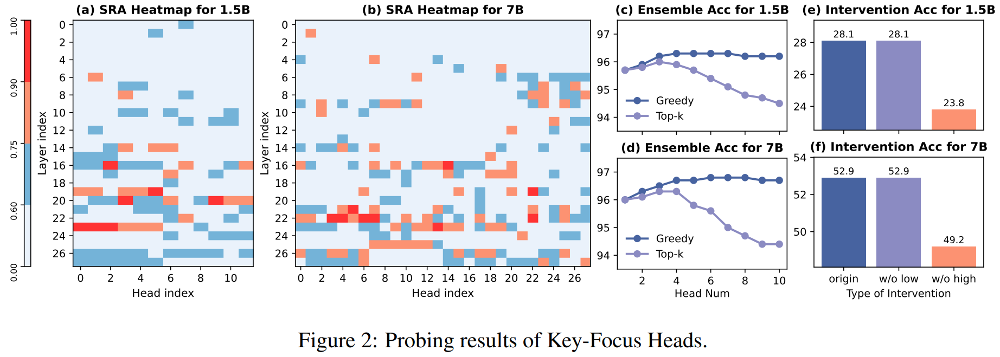
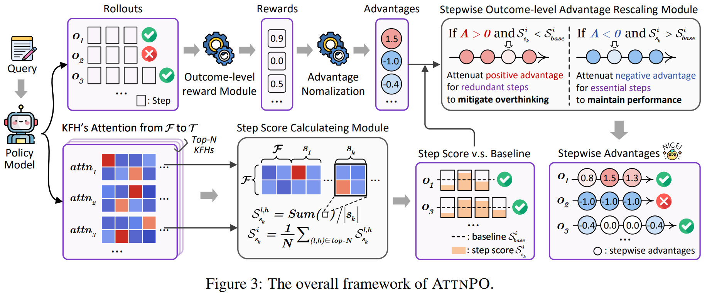

# ATTNPO: Attention-Guided Process Supervision for Efficient Reasoning


<div align="center">
  <a href="https://arxiv.org/abs/2602.09953"></a>
  <a href="https://huggingface.co/collections/ShuaiyiNie/attnpo"></a>
</div>

## 🚀 Release

**[2025/04/20]** 🔥 We have open-sourced the AttnPO codebase and model weights!

**[2025/04/06]** 🎉 Our paper has been accepted to **ACL 2026 (Main)**!

**[2025/02/10]** 🔥 We released our paper on arXiv: [AttnPO: Attention-Guided Process Supervision for Efficient Reasoning](https://arxiv.org/abs/2602.09953)

## 📖 Introduction

Large reasoning models trained with reinforcement learning and verifiable rewards (RLVR) achieve strong performance on complex reasoning tasks, yet often overthink, generating redundant reasoning without performance gains. 
- **Trajectory-level length penalties** often fail to effectively shorten reasoning length and degrade accuracy, as they uniformly treat all reasoning steps and lack fine-grained signals to distinguish redundancy from necessity.
- **Process-supervised methods** are typically resource-intensive and suffer from inaccurate credit assignment. 

To address these issues, we propose ATTNPO, a low-overhead process-supervised RL framework that leverages the model’s intrinsic attention signals for step-level credit assignment. We first identify a set of special attention heads that naturally focus on essential steps while suppressing redundant ones. By leveraging the attention scores of these heads, We then employ two sub-strategies to mitigate overthinking by discouraging redundant steps while preserving accuracy by reducing penalties on essential steps. Experimental results show that ATTNPO substantially reduces reasoning length while significantly improving performance across 9 benchmarks.

<div align="center">
  
  
</div>

## 📦 Contents

### Step 1: Set Up the Environment

```bash
git clone https://github.com/NieSYsc20/AttnPO.git
cd ATTNPO
conda create -n attnpo python==3.10
conda activate attnpo
pip install --no-deps -e .
pip install -r requirements.txt
pip3 install flash-attn==2.7.4.post1 --no-build-isolation
# Replace the default Qwen2 modeling file in transformers with the AttnPO-modified version
cp modeling_qwen2.py $(python -c "import transformers; import os; print(os.path.join(os.path.dirname(transformers.__file__), 'models/qwen2/modeling_qwen2.py'))")
```

### Step 2: Training
```bash
bash scripts/attnpo_ds1.5b.sh
```

## 📝 Citation

If you find our work useful, please consider citing our paper:

```bibtex
@article{nie2026attnpo,
  title={ATTNPO: Attention-Guided Process Supervision for Efficient Reasoning},
  author={Nie, Shuaiyi and Ding, Siyu and Zhang, Wenyuan and Yu, Linhao and Yang, Tianmeng and Chen, Yao and Liu, Tingwen and Yin, Weichong and Sun, Yu and Wu, Hua},
  journal={arXiv preprint arXiv:2602.09953},
  year={2026}
}
```
